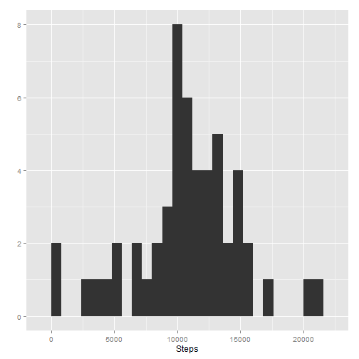
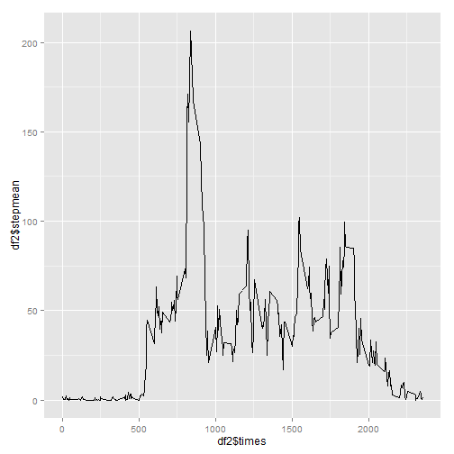
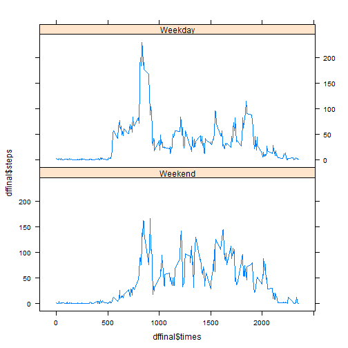

**Loading and processing the data**

Show any code that is needed to:

- Load the data (i.e. read.csv())
- Process/transform the data (if necessary) into a format suitable for your analysis

The first steps I went through were to download and uzip the data if the file does not exist.  I also loaded the required packages.

```r
require(ggplot2)
```

```
## Loading required package: ggplot2
```

```r
require(lattice)
```

```
## Loading required package: lattice
```

```r
if(!file.exists("activity.csv")){download.file("https://d396qusza40orc.cloudfront.net/repdata%2Fdata%2Factivity.zip"
              ,"amd.zip")
        unzip("amd.zip")
}
```
Next, we read in the data:


```r
use <- read.csv("activity.csv")
```

Now on to processing.  The first thing we did was to change the date column of the data into an date format.  This was the only piece of processing that would go into every piece.


```r
use$date <- as.Date(use$date)
```

**What is mean total number of steps taken per day?**

* Calculate the total number of steps taken per day
* If you do not understand the difference between a histogram and a barplot, research the difference between them. Make a histogram of the total number of steps taken each day
* Calculate and report the mean and median of the total number of steps taken per day

First, we remove any data that are not complete:

```r
use1 <- use[complete.cases(use),]
```
Next, we create a vector of all the unique dates:

```r
dates <- unique(use1$date)
```
Now, we calculate the mean number of steps taken each day:

```r
steps  <- c()
for(i in 1:length(dates)){
        use1.sub <- subset(use1, use1$date == dates[i])
        steps <- c(steps, sum(use1.sub$steps))
}
```
Finally, we use this to create a histogram:

```r
#create a data frame with only steps and date
df <- data.frame(dates, steps)

#Make a histogram of the total number of steps taken each day
qplot(df$steps, geom = "histogram", binwidth = 800, xlab="Steps", ylab="")
```

 

The mean and median number of steps taken each day is:

```r
cat("The mean steps per day is: ",mean(df$steps))
```

```
## The mean steps per day is:  10766.19
```

```r
cat("The median number of steps per day is: ", median(df$steps))
```

```
## The median number of steps per day is:  10765
```

**What is the average daily activity pattern?**

* Make a time series plot (i.e. type = "l") of the 5-minute interval (x-axis) and the average number of steps taken, averaged across all days (y-axis)

* Which 5-minute interval, on average across all the days in the dataset, contains the maximum number of steps?

First, we remove any data that are not complete, and create the needed variables:

```r
use2 <- use[complete.cases(use),]
times <- unique(use2$interval)
stepmean  <- c()
```

Now, we calculate the mean number of steps taken each time period:

```r
for(i in 1:length(times)){
        use2.sub <- subset(use2, use2$interval == times[i])
        stepmean <- c(stepmean, mean(use2.sub$steps))
}
```

Finally, we use this to create a time series plot:

```r
df2 <- data.frame(times, stepmean)
qplot(df2$times,df2$stepmean, geom="path")
```

 

And we find the time interval with the highest mean:

```r
cat("The time period with the highest mean is from",
    df2$times[which.max(df2$stepmean)],
    " to ",
    df2$times[which.max(df2$stepmean)+1])
```

```
## The time period with the highest mean is from 835  to  840
```

**Imputing missing values**

Note that there are a number of days/intervals where there are missing values (coded as NA). The presence of missing days may introduce bias into some calculations or summaries of the data.

* Calculate and report the total number of missing values in the dataset (i.e. the total number of rows with NAs)

```r
use3 <- use[!complete.cases(use),]
print(nrow(use3))
```

```
## [1] 2304
```

* Devise a strategy for filling in all of the missing values in the dataset. The strategy does not need to be sophisticated. For example, you could use the mean/median for that day, or the mean for that 5-minute interval, etc.

* Create a new dataset that is equal to the original dataset but with the missing data filled in.

* Make a histogram of the total number of steps taken each day and Calculate and report the mean and median total number of steps taken per day. Do these values differ from the estimates from the first part of the assignment? What is the impact of imputing missing data on the estimates of the total daily number of steps?

I chose to use the mean of the corresponding 5 minute interval to replace the value for each missing value.

```r
cleaned <- use
for(i in 1:nrow(cleaned)){
        if(is.na(cleaned$steps[i])){
              cleaned$steps[i] <- df2$stepmean[which(df2$times==cleaned$interval[i])]
        }
}
```

We create a new data frame that contains the total imputed steps with the same method as the second part. 

```r
imputedsteps  <- c()
for(i in 1:length(dates)){
        imputedsteps<- c(imputedsteps,(with(cleaned, sum(cleaned$steps[cleaned$date == dates[i]]))))
}
df3 <- data.frame(dates, imputedsteps)
```

The new histogram, means and medians, show that the data set is virtually the same:

```r
qplot(df3$imputedsteps, geom = "histogram", binwidth = 800)
```

 

```r
#The mean number of steps per day is:
print(mean(df3$imputedsteps))
```

```
## [1] 10766.19
```

```r
#The median number of steps per day is:
print(median(df3$imputedsteps))
```

```
## [1] 10765
```

**Are there differences in activity patterns between weekdays and weekends?**

For this part the weekdays() function may be of some help here. Use the dataset with the filled-in missing values for this part.

* Create a new factor variable in the dataset with two levels ??? ???weekday??? and ???weekend??? indicating whether a given date is a weekday or weekend day.

* Make a panel plot containing a time series plot (i.e. type = "l") of the 5-minute interval (x-axis) and the average number of steps taken, averaged across all weekday days or weekend days (y-axis). See the README file in the GitHub repository to see an example of what this plot should look like using simulated data.

First, we add a new column to the cleaned data that indicates whether the measurement is from a weeday or weekend:

```r
dayofweek <- factor()
for(i in 1:nrow(cleaned)){
        if(weekdays(cleaned$date[i])=="Saturday"|weekdays(cleaned$date[i])=="Sunday"){
                dayofweek<-c(dayofweek, "Weekend")
        }           
        else{
                dayofweek<-c(dayofweek, "Weekday")
        }
}

cleaned<-cbind(cleaned, dayofweek)
```

Next, we calculate the mean steps over the interval for both weekends and weekdays:

```r
wkndsteps <- c()
wkdysteps <- c()
for(i in 1:length(times)){
        clesub <- subset(cleaned, cleaned$interval == times[i] & cleaned$dayofweek == "Weekday")
        wkdysteps <- c(wkdysteps, mean(clesub$steps))
}
for(i in 1:length(times)){
        clesub <- subset(cleaned, cleaned$interval == times[i] & cleaned$dayofweek == "Weekend")
        wkndsteps <- c(wkndsteps, mean(clesub$steps))
}
df4 <- data.frame(times, steps = wkndsteps, day = rep("Weekend"))
df5 <- data.frame(times, steps = wkdysteps, day = rep("Weekday"))
dffinal <- rbind(df4,df5)
```

Finally, we create the plot to compare weekend and weekday means over the range of intervals.

```r
xyplot(dffinal$steps~dffinal$times|dffinal$day, layout =c(1,2), type = "a")
```

 
